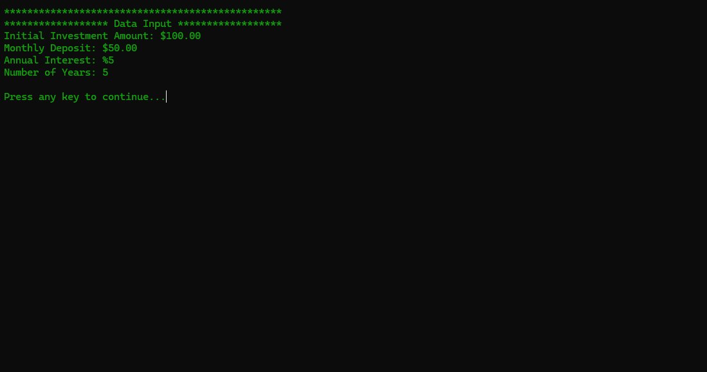
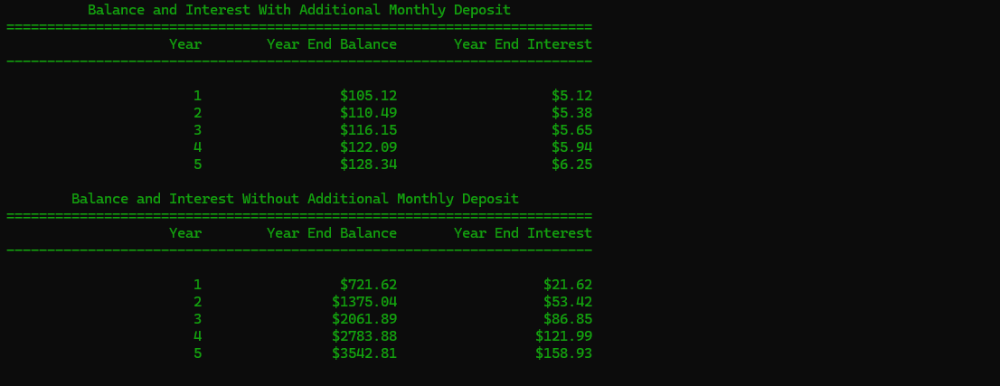

# Airgead Banking

An application for calculating compound interest for given period of time(in years).
This project was done as a part of CS210 at Southern New Hampshire University.

## Screenshots


<br>


## How to run

1. Download and install <a href="https://cmake.org/download/" target="_blank">CMake</a> and <a href="https://git-scm.com/install/windows" target="_blank">Git</a> if you don't have it installed.

2. Generate project files using

    ```bash
        cmake -B build
    ```

3. Run the build using commandline
    ```bash
        cmake --build build
        ./build/Debug/AirgeadBanking.exe # To Run the playground
    ```
    OR
    Run it in Visual Studio or your IDE of choice `(build/AirgeadBanking.slnx)`.
